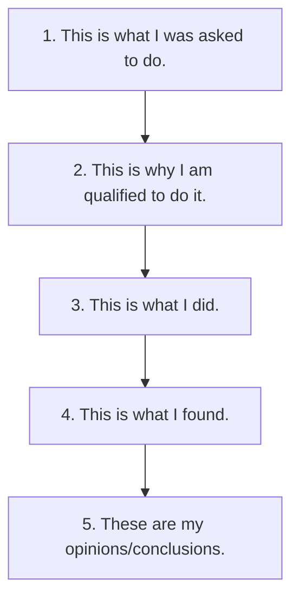

## **Prologue**

{:.shadow}

***"How do I write a good DFIR report?"*** -Literally Everyone at some point

You wouldn't believe how many times that question gets asked out of me here at Marshall University (and sometimes in the DFIR community). Year after year I've given the same answer: a list full of outdated links and a verbal "laundry list" collection of tidbits and othe documents I've collected and have seen work over my 15+ years of working in this field. Hence, the motivation to put together a compendium of resources and "lessons learned" into a single, living resource per-se. As digital forensic examiners/analysts it's a given that we must report and present our findings on a very technical process in a simplistic manner. I always tell students and colleagues that everything should distilled down to *"make sense to "your 80 old grandmother."* I think most all of us can relate to that funny, yet so-true symbolism. However, that *grandmother* may be a supervisor, client, attorney, or even a judge and/or jury who will read and interpret your report after it has been cross-examined. Are you prepared to explain your highly technical findings to a lay audience? Furthermore, does the report prepare YOU to explain your findings? When the case goes to trial and you are called upon to testify a year or more in the future will you be able to remember the case based simply from the details you included in your digital forensic report? Better yet, will someone else be able to make sense of (or even validate) your findings if you're not around to explain them? Newbie or seasoned examiner, these concerns bring about questions: **What templates do I use? What headings do I include? How do I list figures?** The list can go on and on and on. That all said, I'll do my best to address these (and a host of other things) in this article. 

Without wasting any time, let's start at the the first, and most important, question on the list: *"Where do I start?"* For me a good report ALWAYS starts with two important phases: 
* 1) Good planning and preparation 
* 2) Good case notes/bench notes

## **Planning & Preparation**
***"Failing to prepare is preparing to fail"*** -Coach John Wooden

As a young examiner years ago I was working a case that involved a hodgepodge of stolen items: guns, money, and a dog (yes a dog). The detective on the case brought me a phone, laptop, and thumb drive that they had seized as part of the case. Multiple times throughout the course of that case, the detective continued to drop by the lab to supply me with *intelligence* which was nothing more than additional keywords and suspect names to search for pertaining the case. This process repeated itself it least 4-5 more times over the course of the next 3 months. Even when drafting the report, the detective was STILL giving me keywords! A process that should have taken a few weeks weeks took months and hours of fruitless searches. The report took *forever* to draft because of the complexity of the searches and steps performed. The suspect ended up taking a plea deal over a single Google search that I found on the laptop that matched the model of gun stolen. After the trial the prosecutor thanked me for the report and made the statement that he was only concerned about the gun keywords and nothing else (as the gun theft/crime was the only charge the suspect was facing). Everything else had been dropped early on. At the end of this I was asking myself "What if better planning had been executed?" Later in my career I sought to answer these questions *BEFORE* I began the case rather than after. This better planning, in turn, led to better, more concise reports. 

There are dozens of models that describe the digital forensic process and how to approach this planning. A good read that approaches this process head-on is the article written by Dr. Mark Pollitt (one of my early graduate school and career mentors) titled [*The key to forensic success: examination planning is a key determinant of efficient and effective digital forensics*](https://doi.org/10.1016/B978-0-12-804526-8.00002-2). In this paper, Dr. Pollitt approaches examination planning through using the [National Institute of Standards and Technology (NIST) SP 800-86](https://nvlpubs.nist.gov/nistpubs/Legacy/SP/nistspecialpublication800-86.pdf), which describes the process in four (4) stages, defined as follows:

* **Collection:** Data are identified, labeled, recorded, and acquired from all of the possible sources of relevant data, using procedures that preserve the integrity of the data. Data should be collected in a timely manner to avoid the loss of dynamic data, such as a list of current network connections, and the data collected in cell phones, PDAs, and other battery-powered devices.

* **Examination:** The data that are collected should be examined using a combination of automated and manual methods to assess and extract data of particular interest for the specific situation, while preserving the integrity of the data.

* **Analysis:** The results of the examination should be analyzed, using well-documented methods and techniques, to derive useful information that addresses the
questions that were the impetus for the collection and examination.

* **Reporting:** The results of the analysis should be reported. Items to be reported may include the following: a description of the actions employed; an explanation of how tools and procedures were selected; a determination of any other actions that should be performed, such as forensic examination of additional data sources, securing identified vulnerabilities, and improving existing security controls; and recommendations for improvements to policies, guidelines, procedures, tools, and other aspects of the forensic process. 

Clearly the last stage focuses on the *Reporting* phase of the analysis, which is the major focus of this write-up. But before we move to this phase I want to stop and discuss the second and last important phase leading to an effective report: drafting good case notes/bench notes.

## **Case Notes/Bench Notes**
***"It's easy to use a documentation system before you begin working a case. It's impossible to start one after your case is done..."*** -Brett Shavers ([DFIR.training](https://dfir.training))

**Case Notes (or Bench Notes)** are the detailed notes or contemporaneous records that an analyst takes when analyzing the case in whatever tool (or method) they are using. For some analysts and labs these are merely simple text/document files with items that will be a hard reminder of how to list these items in a report. For other analysts (and ISO 12020/17025 accredited digital forensics labs) these case notes can be rather detailed: screenshots, full, detailed steps of analysis, etc. I'll admit that early in my career I truly undervalued the importance of case notes and how they led to a better report. I treated them more like post-it's and reminders rather than complimentary to the report. Now, with years of experience under my belt, the value of good notes is no-doubt at the top of my list. I'm sure at this point you are asking **"What should my case notes look like?"** Well that depends on a variety of factors. First and foremost you have to figure out how all of this fits into the operational flow of your laboratory. Furthermore, you want to consider that these case notes should be bringing you to the ultimate goal of producing a better forensic report and not just adding additional burden upon your caseload.

***"Are my case notes discoverable in court?"*** 

Well, that answer depends. In all my years I never really had a clear, concrete answer to point to, so to answer this question I took to Twitter (see below) to ask the DFIR community. The responses were interesting... 

<blockquote class="twitter-tweet">
This might be a somewhat naive question but this question has stumped me for years: “Are forensic bench/case notes discoverable in court?”
&mdash; Josh Brunty (@joshbrunty) <a href="https://twitter.com/joshbrunty/status/1335732128705728512?ref_src=twsrc%5Etfw">December 6, 2020</a></blockquote> 

As you can see there is a consensus on the the answer: *"Yes."* Long story short, case notes *are* discoverable under the Federal Rules of Criminal/Civil Procedure. Although there are loopholes in the court such as: claiming the notes as attorney work product or just not turning the notes in with the final report altogether. That all said, it's still important to keep detailed case notes not just for court discovery, but to refresh your own memory if, and when you get to drafting the final report.

***What software and/or templates do I use to keep such notes?***

Good question! There are both paid and open-source applications out there to manage case notes. Some are tailored to forensics, some are not. [Forensic Notes](https://www.forensicnotes.com/) is one such option for DFIR. Forensic Notes stores all notes, images, and attachments in a timestamped read-only, PDF format to protect the integrity and admissibility of evidence. 



An example Case Notes PDF report can be downloaded [HERE](https://www.forensicnotes.com/wp-content/uploads/2018/12/forensic_notebook_exhibit-1-iphone-6-white.pdf). One of the things I really like & appreciate about Forensic Notes is that it compels DFIR examiners to carefully and contemporaneously take notes in a given investigation. Keep in mind, MOST of the work that DFIR examiners ends up in court and/or legal proceedings in some way, shape or form. Investigators need the ability to document complex investigations and not worry about losing or misplacing critical notes and documents essential for full disclosure if and when such cases reach litigation. Although Word, OneNote, etc. exists and will do the job they aren't really tailored with auditing capabilities and other bells and whistles that come in handy in a digital forensics caseflow. 

Now that we've established our casenotes it's now time to move to the actual Forensic Report. 

## The Forensic Report
Digital and multimedia evidence, as well as the tools, techniques, and methodologies used in an examination, are subject to challenge in a court of law or other formal proceedings. Proper documentation is essential in providing individuals the ability to reproduce the forensic process and the results. [The Scientific Working Group on Digital Evidence (SWGDE)](https://drive.google.com/file/d/1_O1WxWa1FTkOqDPJ3n1aul5VXkGlTAZh/view) states that *Reporting is the process of preparing a summary of steps taken during the examination of digital media.* A thorough examination report is written using documentation collected by the examiner, including photographs, drawings, case-notes, tool-generated content, etc. Many forensic tools come with built-in reporting functionality that is specific to that tool’s actions and results, but does not typically document the full scope of the examination. Tool reports may be considered supporting documentation to the examination report or referenced as an appendix. 

The purpose of the Forensic Report is simply to tell the story of what the presence or absence of the digital artifact indicates, regardless, if it is inculpatory or exculpatory in nature. Reports generally follow a logical flow:

There really isn't a de-facto standard or format per-se. Formatting and layout options are up to the examiner/analyst, or they may be defined by organizational policies or jurisdictional court rules. The report may include something similar or a slightly different flavor to the following: 
* Title Page
* Table of Contents
* Overview/Case/Executive Summary
* Evidence
* Objectives
* Forensic Analysis (Steps Taken) 
* Relevant Findings 
* Conclusion
* Exhibit

### Title Page
The Title Page should, at minimum, include case name, date, investigator name and contact information.

### Table of Contents
The Table of Contents should include each section of the report along with page numbers. If drafting in Microsoft Word a table of contents can be [generated automatically](https://support.microsoft.com/en-us/office/insert-a-table-of-contents-882e8564-0edb-435e-84b5-1d8552ccf0c0). 

### Overview/Case/Executive Summary
This section will vary in length but generally this should be a one-paragraph summary of the entire report. Summaries should be short, sweet, and to-the-point. You will include any relevant information regarding what led to you as the digital forensic examiner/analyst becoming involved with the digital evidence. You may be just receiving the fdigital evidence and someone else conducted the forensic acquisition and this is a good place to document that as this will correlate with your chain of custody information that you immediately started once you came into contact with the digital evidence. Keep in mind, this is an overview and a summary of how the case was initialized and where you as the examiner/analyst became involved.

**Example Case Summary**
*On today's date, Detective Marco Marshall contacted the Digital Forensics Laboratory in regards to extracting data from an Android device that had been recovered from a crime scene. Detective Marshall is requesting a forensic examination to see what information by the suspect(s) may have been deleted and is requesting a full forensic examination and report for possible criminal charges.*

### Evidence
This should be a table or listing of evidence containing the descriptive details of the physical evidence items submitted (hard drives, mobile devices, etc). A good evidence listing will include make, model, serial numbers, description, condition, hash values, custodian information, etc.  

**Example Evidence Listing:** 

### Objectives
this section outlines spcifically what are you being asked to do. You will include your hypothesis here.  It is especially important to include if you were asked to perform a targeted investigation.  Also a good idea to include any specific search terms requested.

### Forensic Analysis (Steps Taken)
This is what you did, what you did it with (including make, model, and version of software, tools, etc.). This section is very important, as you must detail your interaction with the digital evidence and the steps taken to preserve and forensically acquire the evidence. Any additional steps that you take (e.g. forensically wiping storage/examination media, utlizing bootloaders in mobile acquisition, etc.) should be notated in this section of your report. Remember, this section of your report is usually where you as the examiner/analyst came into contact with the digital evidence and thoroughly documenting what you have done is very important to the integrity of the digital evidence and your chain of custody.

**Example #1: Mobile Device Forensics Examination**
* *1) On today's date I began the forensic acquisition process of the Google Android device. Prior to acquisition of the mobile device, the analyst photographed the device, documenting any identifiers (e.g., make, model, serial #), unique markings, visible damage, etc. while maintaining chain of custody.*
* *2) After completing the forensic acquisition of the mobile device via the Android Debug Bridge (ADB) the analyst then analyzed the extraction with forensic tools*
* *3) The analyst used the following tools for forensic analysis, which are licensed to this examiner:*

  * 1) *Cellebrite Physical Analyzer v.7.13 (build 6600)*
  * 2) *Magnet Axiom v.4.16*
  * 3) *Oxygen Forensic Detective v.3.16 (build 3383)*
  * 4) *Android Logs, Events, And Protobuf Parser-ALEAPP v.1.06*

**Example #2: Network Forensics Examination**
* **Analysis #1**- *Initial Inspection: Upon initial download of the file.pcap file onto the desktop of the forensic machine being utilized for investigation, the file was opened using Wireshark v.2.13. Steps were taken to ensure the time and date of packets contained on the file were set to UTC time prior to determining the range of packet captures. The analyst determined the packets to have ranged from 01:51:07 on 07/22/2008 (**Figure 1**) until 06:13:47 on 07/22/2008 (**Figure 2**). The total number of packets contained in the file were then determined by the analyst to be 95,175 packets.*
* **Analysis #2**- *Examination of Protocol Hierarchy: The analyst examined the protocol hierarchy for the entire PCAP file using Wireshark (***Figure 3***) *and found 100% of the packets to be Ethernet, with 95.8% having an IPv4 IP address. Further investigation found that 88.1% of the total packets used Transmission Control Protocol (TCP) and that 10.8% attributed to Hypertext Transfer Protocol (HTTP) (**Figure 4**).*

### Relevant Findings
The Relevant Findings should be most detailed section of your investigation. You will include all artifacts and relevant findings during your analysis relating to the case.  These should be directly related/linked to the Objectives/Falsifiable hypothesis. These should be all of the Bookmarks that you created. Each piece of evidence must be fully explained in a way that a layperson can understand it.

## Other Considerations
### Appendices
Good appendices can make or break a good report. It's a good rule of thumb is to reserve exhibits A and B for your CV and Evidence Chain of Custody, respectively.  Certainly not necessary, but it makes it so you always remember to include them in my reports *(and work from the same template)*. You will need to include a PDF copy of any automated, tool-generated reports (i.e. Cellebrite, Axiom, Autopsy) in your appendices as well. A very good practice when you are including your evidence into your report is to include hyperlinks to exhibits/figures/tables etc. Make sure you test and validate that the hyperlinks work properly so when your report is being reviewed, the reader can navigate easily to the evidence that you are including in your report.

### Formatting 
Reports should include a page number with a total page accountability (*i.e. 6 of 7, 7 of 7*). This will ensure that if a page is removed or separated from your report that it will be easy to spot if that were to occur. A common header and/or footer with distinguishings such as an agency logo, address, examiner name, etc. is also good practice. A title similar to “Report of Examination,” to provide an immediate and accurate identification of the information being provided should also be included. [SWGDE](https://drive.google.com/file/d/1_O1WxWa1FTkOqDPJ3n1aul5VXkGlTAZh/view) also defines General information elements which include:
* A title similar to “Report of Examination,” to provide an immediate and accurate identification of the information being provided
* Name and address of the examining organization/laboratory
* Case identifier and page accountability (page number and total number of pages)
* Date of report (date of final signed version)
* Acronyms and abbreviations defined at first use, if not in the common vernacular of the general public

### Figures
I've written reports with exhibits/figures/tables scattered throughout and reports with exhibits/figures/tables in the appendix. All figures and table must include a descriptive caption. Each caption must include a figure/table number (**bolded**) followed by a detailed description of what the figure/table depicts (i.e. **Figure 4:** Protocol Hierarchy displayed of packet capture displayed in Wireshark)

### Glossary
It's nearly impossible not to utilize scientific terminology when writing a report, especially when describing methodology. The Scientific Working Group on Digital Evidence (SWGDE) provides a [Glossary of Terms](https://drive.google.com/file/d/1ZZwOqgVOWo6qDeoJqv6VKafY2i1RJI2B/view) with general, as well as discipline specific, definitions as they apply across the spectrum of image analysis, digital forensics, video analysis, and forensic audio. ASTM has also developed Standard Guide [E2916](https://www.astm.org/Standards/E2916.htm)-Standard Terminology for Digital and Multimedia Evidence Examination. In addition, NIST OSAC has created a [lexicon](https://www.nist.gov/organization-scientific-area-committees-forensic-science/osac-lexicon) of over 4,000 terms organized by forensic discipline. These terms are aggregated from sources such as aforementioned SWGDE & ASTM glossaries. The Lexicon also includes the source document of the definition. Although it doesn't include every term you would need to define in your forensic reports, each of these are reputable sources with definitions that should stand up in court.

### 1st or 3rd Person?
One question that commonly pops up is: **"Do I write reports in 1st or 3rd person?"** Well the answer is quite simple: **"It depends..."** Once again, I took to Twitterverse to ask the question of the DFIR community. 

<blockquote class="twitter-tweet">
When writing your DFIR reports do you all use 3rd person (the analyst) or first person (I, me)?
&mdash; Josh Brunty (@joshbrunty) <a href="https://twitter.com/joshbrunty/status/1326533717033185280?ref_src=twsrc%5Etfw">November 11, 2020</a></blockquote> 

As you can see the responses varied all over the place, but the general consensus is that the voice should be dependant upon the circumstances itself. Agency policy may dictate that an analyst/examiner write reports in 1st or 3rd person, while an expert report may require you to write in 1st person. That all said, it comes down to the decision of the analyst. It's the whole reason they call us analysts or experts right? 

## **Conclusion**
This document is not intended to be a de-facto standard or a "This is how it's gotta be done" type of article, but rather a roadmap to get an analyst/examiner to the desired result of a good report. There might be factors in additional reporting such expert witness disclosure requirements, requirements mandated by accreditation bodies, and agency protocol, which is not, nor did I desire it to be, considered within the scope of this article.

## **Relevant Links**
* [Forensic Notes Software](https://www.forensicnotes.com/forensic-case-notes/)
* [SANS Intro to Report Writing for Digital Forensics](https://www.sans.org/blog/intro-to-report-writing-for-digital-forensics/) 
* [SWGDE Requirements for Report Writing](https://drive.google.com/file/d/1_O1WxWa1FTkOqDPJ3n1aul5VXkGlTAZh/view)
* [SWGDE Glossary of Terms](https://drive.google.com/file/d/1ZZwOqgVOWo6qDeoJqv6VKafY2i1RJI2B/view)
* [ASTM Standard E2916](https://www.astm.org/Standards/E2916.htm)
* [NIST OSAC Lexicon](https://www.nist.gov/organization-scientific-area-committees-forensic-science/osac-lexicon)
* [NIST SP 800-86](https://nvlpubs.nist.gov/nistpubs/Legacy/SP/nistspecialpublication800-86.pdf)
* [Planning: The key to forensic success- Dr. Mark Pollitt](https://doi.org/10.1016/B978-0-12-804526-8.00002-2)

<!--more-->
